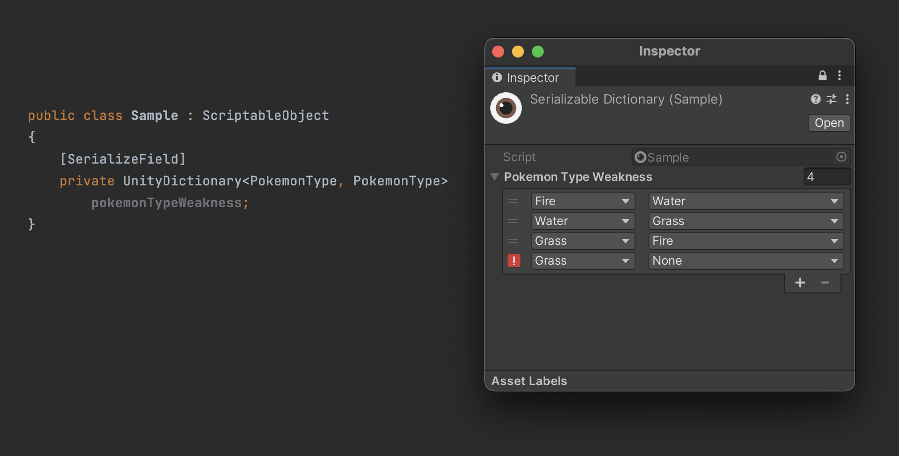
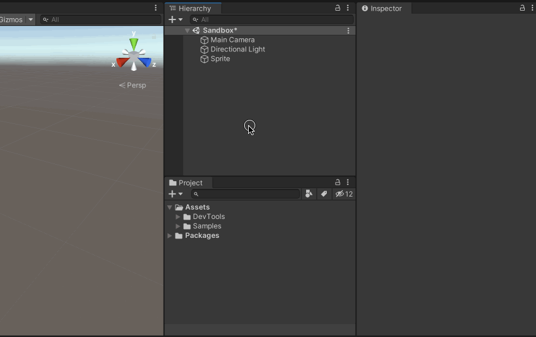
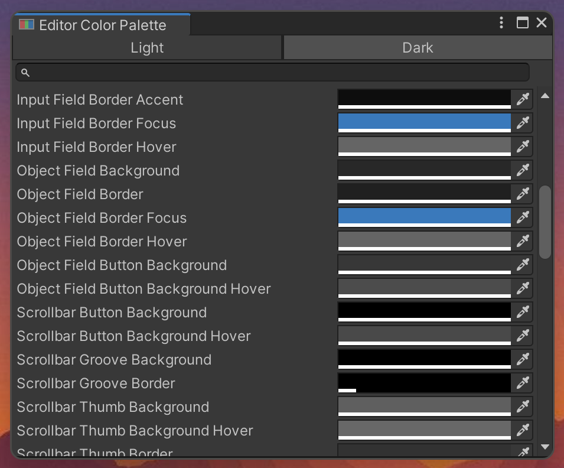

# QuickEye Utility

### `UnityDictionary` Serialized and editable

New type and property drawer to serialize and edit dictionaries in inspector.

### Time Serialization Types

Data types, GUI Controls and Property Drawers related to time.

#### `UnityTimeSpan`

`System.TimeSpan` equivalent. If `TimeOfDayAttribute` is used on serialized field the property drawer will restrain input between `0` and `23:59:59.999`. 

####  `UnityDateTime` & `UnityDateOnly`

`System.DateTime` and .NET 6s `System.DateOnly` equivalents.

## Editor

### Custom Editor Window Title Settings
> 1. Go to: Edit > Preferences (Windows) or Unity > Preferences (macOS)
> 2. Select **Window Title** from sidebar

Modify Unity Editor main window title to include information relevant for you!

### Duplicate Window Action
> - Open from context menu: _Window/Duplicate Window_
> - Shortcut: Shift+Ctrl+D (Windows) or Shift+Cmd+D (macOS)

Handy tool when you need to open another inspector to compare or drag and drop data.
It will duplicate focused editor window, lock it (in case of inspector or project browser) and position it directly next to the original one.

### `EditorColorPalette` and Editor Color Palette Window
> - Open from context menu: _Window/Editor Color Palette_
> - Use `QuickEye.Utility.Editor.EditorColorPalette` class to access colors from code.

Browser for color values used by Unity Editor. 

## More Classes

### `SingletonMonoBehaviour<T>`

`MonoBehaviour` Singleton implementation.
* Allows to define singleton prefabs when used with `SingletonAssetAttribute`
* Takes into account some common problems of many singleton implementations that are out there.

### `SingletonScriptableObject<T>`

`ScriptableObject` Singleton implementation.

* Automatically create scriptable object asset when used with `SingletonAssetAttribute` and `CreateAssetAutomatically`
* Create `SettingsProvider` quickly with `SettingsProviderAttribute` and `SingletonAssetAttribute`

### `Container` and `PoolContainer`

A serializable object that holds a prefab and a `Transform` reference, implements `IList<T>`.
`AddNew` method creates a new instance of prefab inside the transform. Because of `IList<T>`, it functions as a
collection with additional behavior of easy object instantiation.
`PoolContainer` has the same interface but uses object pooling. Cuts much of the boilerplate code with UI scripting.

### `GameObjectPool`

Object pool pattern implementation with Unity specific API.

* Serializable, can be configured from editor.
* Prototype as prefab.
* Configurable transform parent.