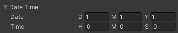
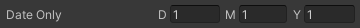

# QuickEye Utility
> Not all of the features are documented

### `SingletonMonoBehaviour<T>`

`MonoBehaviour` Singleton implementation.
* Allows to define singleton prefabs when used with `SingletonAssetAttribute`
* Takes into account some common problems of many singleton implementations that are out there.

### `SingletonScriptableObject<T>`

`ScriptableObject` Singleton implementation.

* Automatically create scriptable object asset when used with `SingletonAssetAttribute` and `CreateAssetAutomatically`
* Create `SettingsProvider` quickly with `SettingsProviderAttribute` and `SingletonAssetAttribute`

### `Container` and `PoolContainer`

A serializable object that holds a prefab and a `Transform` reference, implements `IList<T>`.
`AddNew` method creates a new instance of prefab inside the transform. Because of `IList<T>`, it functions as a
collection with additional behavior of easy object instantiation.
`PoolContainer` has the same interface but uses object pooling. Cuts much of the boilerplate code with UI scripting.

### `GameObjectPool`

Object pool pattern implementation with Unity specific API.

* Serializable, can be configured from editor.
* Prototype as prefab.
* Configurable transform parent.

### Time Serialization Types

Data types, GUI Controls and Property Drawers related to time.
#### `UnityTimeSpan`

`System.TimeSpan` equivalent. If `TimeOfDayAttribute` is used on serialized field the property drawer will restrain input between `0` and `23:59:59.999`. 

####  `UnityDateTime` & `UnityDateOnly`

`System.DateTime` and .NET 6s `System.DateOnly` equivalents.

## Editor

### `EditorColorPalette` and Editor Color Palette Window
#### Open from context menu: _Window/Editor Color Palette_

Browser for color values used by Unity Editor. 

